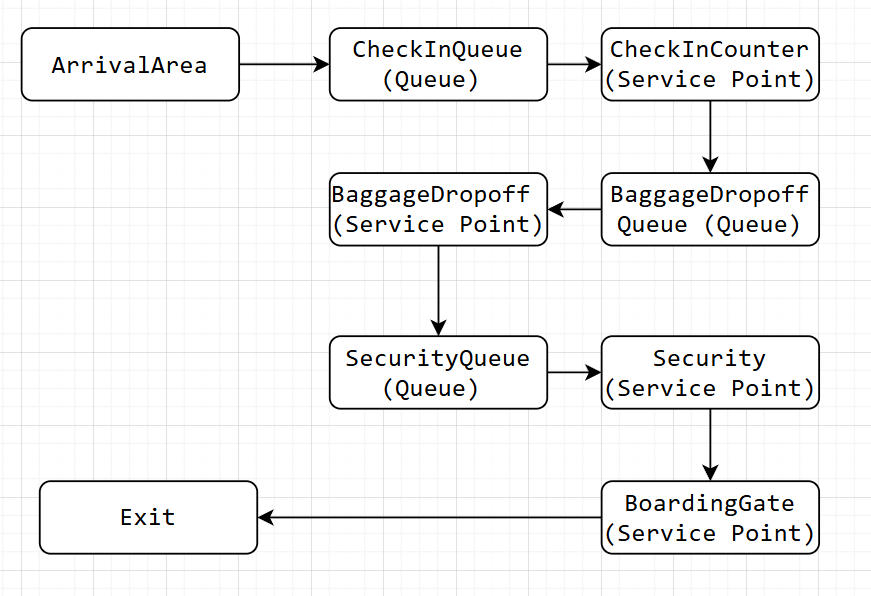
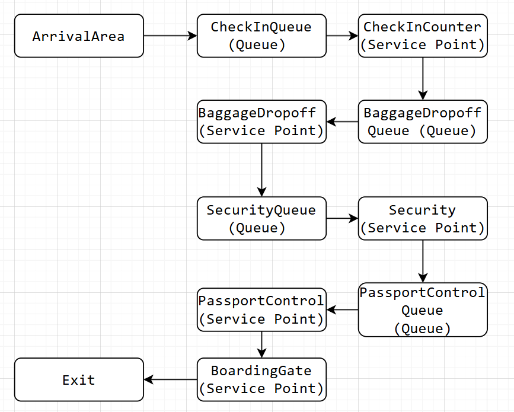

### Task 1 Performance Measures in Airport Simulation
- A (Arrived Clients Count): Total number of passengers arriving at check-in counters or security checkpoints. set a number of passengers in peak time, help to predict overcrowding. Characterization:Track input.
- C (Clients Serviced Count): Number of passengers completed processing at a service point. Characterization: Measure output.
- B (Active Time in Service Point): Total operation time for a service point. time security checkpoint agents are busy. Characterization: Quantifies workload.
- T (Total Simulation Time): Total duration of the airport simulation. such as 24-hour simulation. Characterization: Baseline for rates
- U (Utilization): Fraction of time a service point is actively serving passengers relative to total time. U = B/T. Characterization: Efficiency metric.
- X (Throughput): Passengers processed per unit time at service points like passport control. X = C/T. Characterization: Speed indicator.
- S (Service Time): Average time spent by a passenger receiving service. S = B/C. Characterization: Per-passenger efficiency.
- R_i (Response Time): For each passenger, total time from arrival at queue to completion of service. Characterization: Single Passenger experience 
- W (Total Waiting Time):Sum of waiting times for all passengers at a queue. Characterization: Total delay
- R (Average Response Time): Average time from arrival to service completion per passenger (lead time), R = W/C. Characterization: Overall satisfaction.
- N (Average Customers in System): Average number of passengers in service point including those waiting and served, N = W/T. Characterization: Congestion level.
### Task 2 
- ArrivalTracking: Counting new customer entering the system. Update: At arrival events; increment counters like A.
- CompletionTracking: Counting customer finished service. Update: At service completion; increment counters like C.
- TimeTracking: Measuring busy time, total simulation time. Update: Continuously or at events; add to B when service starts/ends.
- IndividualMetrics: Tracking per-customer experienced times like response and service time. Update: Per customer; record R_i at service end.
- TotalMetrics: like sums (W), averages (R, U), and ratios (X throughput). Update: At events or end; e.g., sum W from Single Passenger waits.
- QueueMetrics: Average queue lengths computed from waiting times and system time. Update: Periodically or at end; get N from W/T.
- UpdateMoments: Metrics are updated at arrival, service start/end, and at periodic sampling or simulation end. General: Real-time for dynamic  like U, batch at end for averages like R.
### Task 3 
- System 1: Domestic Flight Departure Process

- System 2: International Arrival Process

### Task 4
initialize simulation clock time T=0
initialize event list (arrival, service completions, service starts)
while simulation not finished:
    determine next event time and type (arrival or service completion)
    advance clock to next event time
    if event is arrival:
        increment arrivals A
        add entity to appropriate queue
        if service point available:
            start service (Schedule service completion event)
            increment busy time B accordingly
    if event is service completion:
        increment completions C
        release service point capacity
        record response times R_i
        if queue not empty:
            start next service (update busy time B)
update performance statistics periodically or at end
print collected statistics
### Task5
- A_phase: Scheduling and managing arrival events (adding newpassenger to queues, incrementing arrival counters). Explanation: In Storage, add newpassenger to queue and increment A; schedule next arrival in event list.

- B_phase: Handling beginning of services (starting service, allocating servers, updating busy times). Explanation: In Estimator, check if server free, start service, update B, and schedule completion event.

- C_phase: Handling completion of services (departures, recording completed clients count, updating response/wait times). Explanation: In Storage, increment C, record R_i/W, release server; if queue not empty, trigger B-phase for next entity.
